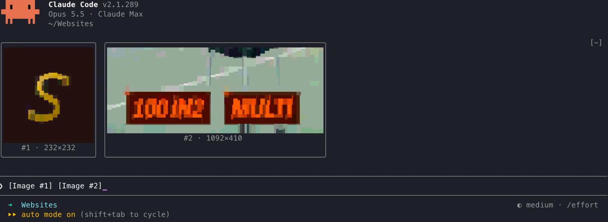

# image-preview

A Claude Code mod that lets you **see the images you paste**.



When you paste an image into Claude Code (ctrl+v, or a file dropped into the
prompt), the prompt only shows `[Image #1]`. This mod draws the picture:

- **Above the prompt, before you send**: a thumbnail for every `[Image #n]` in
  your draft, framed, in a row that always fits. Delete the tag and its tile goes.
- **In a gallery, after**: `/images` opens a pane with every image of the
  session, newest first, each with a **Copy path** button. `/images clear`
  empties it.

## How it draws

| Where | What you get |
| --- | --- |
| kitty, Ghostty | real pixels (kitty graphics protocol) |
| iTerm2, Windows Terminal, WezTerm, VS Code, Alacritty… | block glyphs fitted to the picture (`▁▂▃▄▌▖▗▘▝▚`…), chafa-style: each cell picks the glyph and two colors that match its 4×8 sub-pixels best |
| Terminal.app | half blocks (`▄`): it draws block glyphs from the font, which leaves gaps |
| Claude desktop app (Code tab) | the gallery pane, as an image |

Only kitty and Ghostty can show real pixels inside Claude Code: the mod API
draws pictures with the kitty graphics protocol alone, and Terminal.app has no
image protocol at all (Claude Code also limits it to 256 colors). Elsewhere
the thumbnail is an approximation.

Pick the terminal renderer with the `renderer` option: `auto` (default),
`kitty`, `glyphs` or `halfblocks`. `bandRows` sets the thumbnail height above the prompt.

## Requirements

- Claude Code 2.1.286 or newer (mods / function hooks).
- macOS: nothing to install (uses `sips` and `osascript`).
- Linux: ImageMagick (`magick` or `convert`); `wl-paste` or `xclip` for the
  clipboard fallback.
- Windows: nothing to install (uses Windows PowerShell and its built-in
  System.Drawing). Windows support is new: please report what you see.

## Install

Inside Claude Code:

```
/plugin marketplace add rkueny/claude-code-image-preview
/plugin install image-preview
/reload-plugins
```

Or from your shell:

```bash
claude plugin marketplace add rkueny/claude-code-image-preview
claude plugin install image-preview@claude-code-image-preview
```

To try a local copy without installing it: `claude --plugin-dir <folder>`.

## How it works

- Pasting an image raises no edit event, so the mod reads the prompt every
  200 ms: thumbnails appear as soon as you paste.
- Claude Code stores each pasted image under
  `/tmp/claude-<uid>/<project>/<session>/images/<n>.png` (`$CLAUDE_CODE_TMPDIR`
  in place of `/tmp` when set). On Windows the mod looks for that folder in
  the temp folders (`%TEMP%` and its `claude*` folders). When `[Image #n]` appears in the prompt, the
  mod picks that file up, so the preview shows exactly what Claude will
  receive. If it never appears, the mod reads the clipboard (a file copied in
  the Finder is read from disk, not as its icon).
- Every image that reaches the conversation (`session.append`) is added to
  the gallery, whichever surface it came from.
- Copies for display (a PNG, a BMP for the block renderer, a small JPEG for
  the desktop) go to `$TMPDIR/claude-image-preview/<session>/` (`%TEMP%` on
  Windows) and are deleted
  when the session ends or is cleared.

Nothing leaves your machine: the mod runs only local commands.

## Files

```
.claude-plugin/plugin.json       manifest and options
.claude-plugin/marketplace.json  the marketplace this repository is
hooks/hooks.json                 points at the hooks module
hooks/register.tsx               the hooks: capture, band, gallery, /images
hooks/host.ts                    the commands run on the machine (sips, ImageMagick, PowerShell)
hooks/pixels.ts                  BMP decoding and block-glyph cells
types/index.d.ts                 the mod's state contract
tests/image-preview.test.ts      tests run by `claude plugin test .`
scripts/check-host.ts            runs the real commands on this machine
```

Check it with `claude plugin validate .` and `claude plugin test .`. The
commands the mod runs on each system are checked for real, on Windows, macOS
and Linux, by `scripts/check-host.ts` (GitHub Actions: `.github/workflows/check.yml`).

## Credits

The framed tiles, the row that always fits and the 200 ms poll follow
[jarrodwatts/claude-image-view](https://github.com/jarrodwatts/claude-image-view),
which shows thumbnails in kitty and Ghostty. This mod adds the other
terminals and the gallery.

## License

MIT

---

### En bref (français)

Un mod Claude Code qui affiche les images que vous collez : une vignette
au-dessus du prompt pour chaque `[Image #n]` avant l'envoi, et une galerie de
toutes les images de la session avec `/images`. Vrais pixels dans kitty et
Ghostty, caractères de blocs ajustés à l'image ailleurs. macOS et
Windows sans dépendance ; Linux avec ImageMagick.
